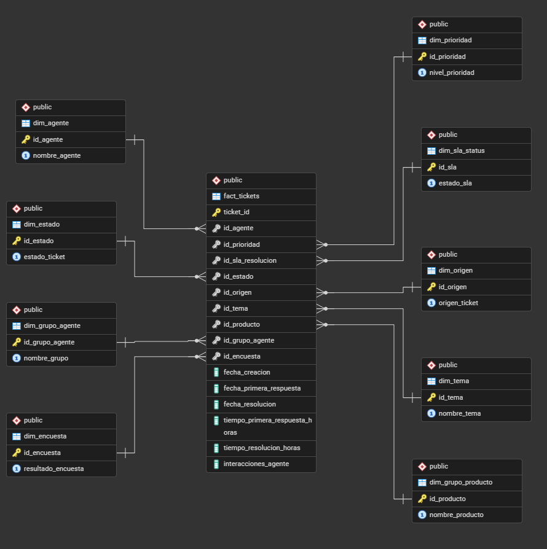

# 📊 Análisis de SLA y Rendimiento de Soporte Técnico (Help Desk)

Este proyecto es una solución analítica de extremo a extremo (End-to-End) diseñada para evaluar la eficiencia operativa, el cumplimiento de los Acuerdos de Nivel de Servicio (SLA) y la gestión del Backlog de un área de soporte técnico corporativo. 

A través de Ingeniería de Datos en **PostgreSQL** y visualización avanzada en **Power BI**, este modelo transforma un registro transaccional de incidentes en una herramienta de toma de decisiones estratégicas.

## 📁 Fuente de Datos
Los datos utilizados para este proyecto provienen del **Technical Support Dataset** disponible públicamente en **Kaggle**. Este conjunto de datos contiene un registro transaccional detallado de tickets, incluyendo fechas de ingreso y resolución, prioridades, tipos de incidentes, agentes asignados y el estado final del cumplimiento del SLA.
https://www.kaggle.com/datasets/suvroo/technical-support-dataset/data

## 🛠️ Stack Tecnológico
* **Base de Datos:** PostgreSQL (pgAdmin 4)
* **Visualización & BI:** Power BI Desktop
* **Lenguajes:** SQL, DAX, Power Query (M)

## 🏗️ Arquitectura de Datos: Modelo de Estrella (Star Schema)
Para optimizar el rendimiento de las consultas y estructurar la información con estándares de Business Intelligence, los datos en crudo (provenientes de Kaggle) fueron procesados y modelados en una arquitectura de Estrella compuesta por **1 Tabla de Hechos** y **9 Tablas Dimensionales**.

 

## 📈 KPIs y Métricas Clave (Motor DAX)
El modelo analítico se sostiene sobre medidas DAX diseñadas para responder a preguntas directas de negocio:
* **Total de Tickets Ingresados:** Volumen general de carga operativa.
* **Backlog (Tickets Pendientes):** Cuantificación de la deuda operativa viva (Estados: *Open*, *In progress*).
* **% de Cumplimiento SLA:** Métrica principal de éxito, evaluada dinámicamente con formato condicional (Meta: 85%).
* **Distribución de Pareto (80/20):** Cálculo de porcentaje acumulado con lógica de desempate alfabético y exclusión ponderada de la categoría "Other" para estándares de Calidad de Software.

## 💡 Resumen de Hallazgos Clave (Insights)
Basado en el análisis histórico del reporte, se identificaron los siguientes comportamientos operativos:

1. **Tendencia del Nivel de Servicio:** El porcentaje de cumplimiento del SLA muestra una caída sostenida a lo largo de los meses, iniciando sobre el 75% en enero y decayendo hasta rozar el 60% hacia el cierre del año.
2. **Concentración de Incidentes (Regla 80/20):** El 80% del volumen total de tickets generados se concentra estrictamente en cuatro categorías operativas: *Product setup*, *Pricing and Licensing*, *Feature request* y *Purchasing and invoicing*.
3. **Rendimiento del Equipo:** La tasa de resolución a tiempo por analista se mantiene por debajo del 70% de forma generalizada, siendo Heather Urry la única especialista de soporte que logra superar ligeramente esta barrera.

## 🧠 Habilidades Técnicas Demostradas
* **Modelado de Datos:** Transición de bases planas a esquemas relacionales (OLTP a OLAP) usando PKs y FKs numéricas eficientes.
* **Resolución de Dependencias:** Manejo avanzado en Power Query para evitar errores de dependencia circular al ordenar categorías nominales (ej. Niveles de Prioridad).
* **Inteligencia de Tiempo:** Creación de una `Dim_Calendario` robusta en DAX para desvincular la jerarquía automática y permitir análisis cronológicos limpios.
* **UX/UI Corporativo:** Diseño de interfaz orientado a la toma de decisiones, minimizando el "ruido visual" y aplicando formato condicional de alertas.

## 📂 Estructura del Repositorio
* `/scripts/`: Contiene el archivo `.sql` con los comandos DDL y DML para recrear la base de datos y el modelo de estrella en PostgreSQL.
* `/dashboard/`: Contiene el archivo `.pbix` con el modelo relacional, las medidas DAX y la interfaz visual final.
* `/assets/`: Imágenes y diagramas de soporte.

---
*Desarrollado por Christian Renato Garcia Fernandez - Marzo 2026*